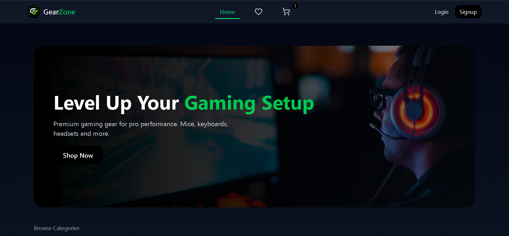
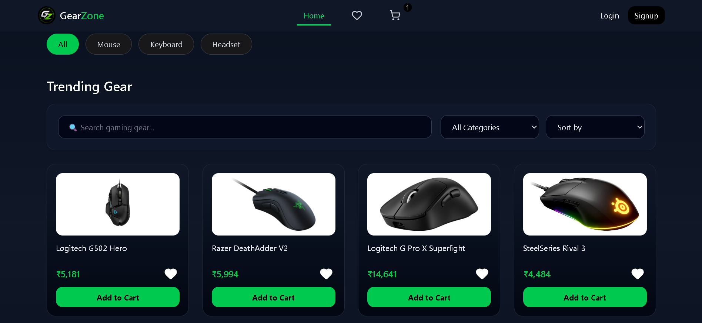
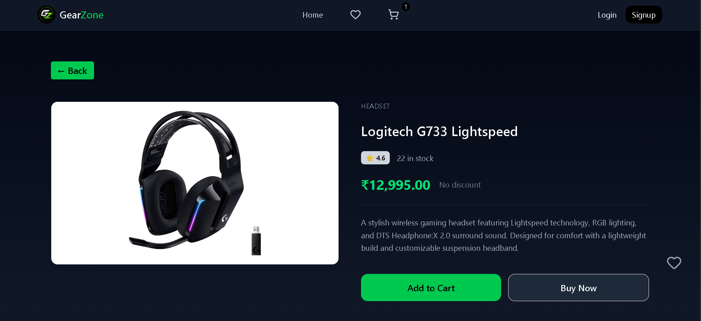
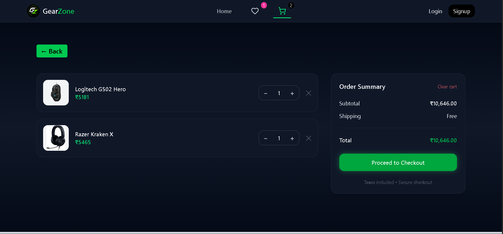

🎮 Gaming Gear Shop

## 📸 Screenshots






A modern e-commerce web application for browsing and purchasing gaming peripherals like mice, keyboards, and headsets. Built with a focus on performance, scalability, and real-world UX patterns.

🚀 Live Demo

👉 https://gaming-gear-shop.geetanshupatil2004.workers.dev/

✨ Features
🔍 Smart Search
Debounced search for better performance
Multi-field search (name, brand, category, features, specs)
URL-synced filters for shareable search states
🛍️ Product Browsing
Clean product grid layout
Category-based filtering
Price sorting (Low → High / High → Low)
Skeleton loaders for smooth UX
📄 Product Details
Detailed product descriptions
Features & specifications section
Wishlist functionality
Add to cart support
❤️ Wishlist & Cart
Add/remove products from wishlist
Add products to cart with toast notifications
🧠 Tech Stack
Frontend: React + Vite
State Management: Redux Toolkit
Routing: React Router
Styling: Tailwind CSS
Icons: Lucide React
Notifications: React Hot Toast
Deployment: Cloudflare Pages
⚡ Performance Optimizations
useMemo for optimized filtering
Debounced search input
Cached API calls (Redux thunk logic)
Lazy rendering with skeleton loaders

## 📂 Project Structure

```src/
├── app/ # Redux store setup
├── features/ # Feature-based modules
│ ├── products/ # Product listing & details
│ ├── cart/ # Cart functionality
│ ├── wishlist/ # Wishlist functionality
├── shared/ # Reusable components & utilities
│ ├── components/
│ ├── utils/
├── hooks/ # Custom React hooks
```

# Clone the repo
git clone https://github.com/your-username/gaming-gear-shop.git

# Navigate into project
cd gaming-gear-shop

# Install dependencies
npm install

# Run development server
npm run dev
🏗️ Build for Production
npm run build
🌐 Deployment

This project is deployed using Cloudflare Pages with a global CDN for fast performance.

📈 Future Improvements
Product reviews & ratings
Authentication (Login / Signup)
Backend integration (Node.js / Express)
Payment gateway (Stripe)
Product comparison feature
Search suggestions & autocomplete
🙌 Acknowledgements
Inspired by modern e-commerce platforms
Built as part of a personal portfolio project
📬 Contact

If you’d like to connect or collaborate:

GitHub: https://github.com/GeetanshuPatil
LinkedIn: www.linkedin.com/in/geetanshu-patil-923637375